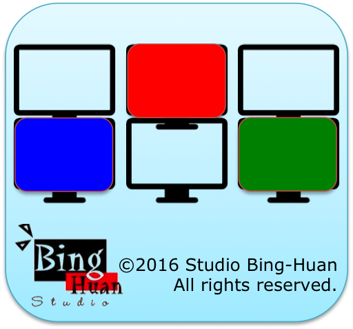

# tvWall

A web application that displays multiple Taiwanese TV news channels in a grid layout, creating a "TV wall" experience using YouTube's live streams.

<br/>

**Live Demo:** <a href="http://binghuan.github.io/tvwall/" target="_blank">http://binghuan.github.io/tvwall/</a>

## Overview

tvWall is a responsive web application that aggregates live Taiwanese news channels from YouTube into a single view. Users can watch multiple news sources simultaneously, with audio control activated by hovering over each video player.

### Features

- **Multi-channel Display**: Displays 8 major Taiwanese news channels simultaneously
- **Interactive Audio**: Hover over any video to unmute and listen to that channel
- **Auto-play**: All videos start playing automatically when the page loads
- **Responsive Design**: Built with Bootstrap for mobile and desktop compatibility
- **Live Streaming**: All channels are live YouTube streams, providing real-time news coverage

### Supported Channels

The application includes the following Taiwanese news channels:

1. **公共電視 (PTS)** - Public Television Service
2. **民視新聞 (FTV)** - Formosa Television News
3. **華視新聞 (CTS)** - Chinese Television System News
4. **東森新聞 (EBC)** - Eastern Broadcasting Company News
5. **三立新聞 (SET)** - Sanlih E-Television News
6. **中視新聞 (CTV)** - China Television News
7. **中天新聞 (CTI)** - Chung T'ien Television News
8. **大愛電視台** - Tzu Chi DaAi TV

## Technical Details

### Technologies Used

- **Frontend**: HTML5, CSS3, JavaScript (ES5)
- **Framework**: Bootstrap 3.x for responsive design
- **API**: YouTube IFrame Player API for video embedding
- **Library**: jQuery 2.2.2 for DOM manipulation

### Project Structure

```
tvwall/
├── index.html              # Main HTML file
├── css/                    # Bootstrap CSS files
├── js/
│   ├── main.js            # Core application logic
│   ├── tvList.js          # Channel configuration
│   ├── jquery-2.2.2.min.js
│   └── bootstrap.min.js
├── icons/                 # App icons for various platforms
├── images/
│   └── demo.png          # Demo screenshot
└── fonts/                # Bootstrap font files
```

### How It Works

1. **Channel Configuration**: The `tvList.js` file contains an array of channel objects with YouTube video IDs and titles
2. **Dynamic Player Creation**: The main script dynamically creates YouTube iframe players for each channel
3. **Audio Management**: Players are muted by default; hovering over a player unmutes it while muting others
4. **Responsive Layout**: Bootstrap classes ensure the layout adapts to different screen sizes

### Installation & Usage

1. **Clone the repository:**
   ```bash
   git clone https://github.com/binghuan/tvwall.git
   cd tvwall
   ```

2. **Serve the files:**
   You can use any web server. For example, with Python:
   ```bash
   # Python 3
   python -m http.server 8000
   
   # Python 2
   python -m SimpleHTTPServer 8000
   ```

3. **Open in browser:**
   Navigate to `http://localhost:8000` in your web browser

### Configuration

To modify the channel list, edit the `tvList` array in `js/tvList.js`:

```javascript
var tvList = [
    {
        "id": "YOUTUBE_VIDEO_ID",
        "title1": "Channel Name in Chinese",
        "title2": "Channel Name in English"
    }
    // Add more channels as needed
];
```

### Browser Compatibility

- Chrome (recommended)
- Firefox
- Safari
- Edge
- Internet Explorer 9+ (with HTML5 shim)

## Development

### Prerequisites

- Modern web browser with JavaScript enabled
- Internet connection (for YouTube API and live streams)

### Local Development

1. Fork and clone the repository
2. Make your changes
3. Test in multiple browsers
4. Submit a pull request

## Blog Post

For more details about the development process, check out the blog post: 
<a href="http://studiobinghuan.blogspot.tw/2016/03/tvwall.html">http://studiobinghuan.blogspot.tw/2016/03/tvwall.html</a>

## Screenshot

### Illustration


---

*Note: This application relies on YouTube's live streams. Channel availability may vary depending on the broadcasters' streaming schedules.*